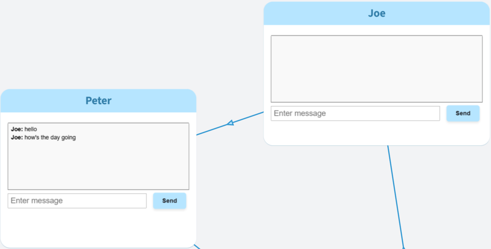
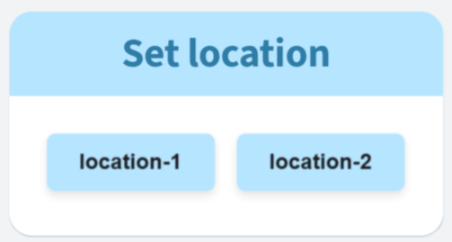

# Embed communication examples for OrgPad

Two simple websites showcasing [embed communication](https://orgpad.info/s/embed-messaging) added to [OrgPad](https://orgpad.info). These websites are built in simple HTML, CSS and JS.

### send-message

A message client which contains received messages and allows sending messages to another instance of this client.

Used with two query parameters:
- `username` - the message sender,
- `target` - id of the target embedded website.

Example URL:
```
https://jansuran03.github.io/orgpad-embed-messaging/send-message.html?username=Joe&target=Peter
```

This renders the top right embed for Joe who can send messages to Peter.



### set-location

Accepts a single query parameter `location` of a comma-separated ids of location. For each location, a button is created. After clicking the button, its location is set in the OrgPage.

Example URL:
```
https://jansuran03.github.io/orgpad-embed-messaging/set-location.html?locations=location-1,location-2
```


